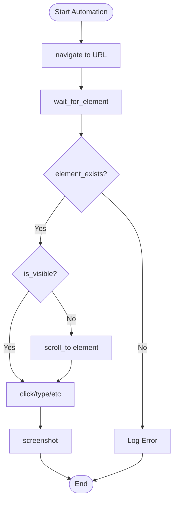

# Browser Action Flowcharts

This document contains visual flowcharts showing how different browser actions work and interact with each other.

## Table of Contents

1. [Action Categories Overview](#action-categories-overview)
2. [Common Workflow Patterns](#common-workflow-patterns)
3. [Form Submission Flow](#form-submission-flow)
4. [Data Extraction Flow](#data-extraction-flow)
5. [Navigation Flow](#navigation-flow)
6. [Multi-Tab/Frame Flow](#multi-tabframe-flow)
7. [Error Handling Flow](#error-handling-flow)
8. [Complete Automation Flow](#complete-automation-flow)

---

## Action Categories Overview

---

## Common Workflow Patterns

### Basic Page Interaction Pattern

### Wait Strategy Pattern

---

## Form Submission Flow

---

## Data Extraction Flow

---

## Navigation Flow

---

## Multi-Tab/Frame Flow

---

## Error Handling Flow

---

## Complete Automation Flow

---

## Detailed Action Flow: Form Filling

---

## Action Dependencies

---

## Screenshot Decision Flow

---

## Cookie Management Flow

---

## Alert/Dialog Handling Flow

---

## Data Validation Pattern

---

## Legend

### Node Types

- **Rectangle**: Action or process
- **Diamond**: Decision point
- **Rounded Rectangle**: Start/End point
- **Parallelogram**: Input/Output
- **Hexagon**: Preparation step

### Arrow Types

- **Solid arrow** (→): Primary flow
- **Dotted arrow** (⋯>): Dependency or recommendation
- **Thick arrow** (⟹): Important path

### Color Coding (when rendered)

- **Blue**: Actions
- **Green**: Success paths
- **Red**: Error paths
- **Yellow**: Decision points

---

## How to Use These Flowcharts

1. **Planning**: Use flowcharts to plan automation sequences
2. **Debugging**: Follow flowcharts to identify where workflow failed
3. **Documentation**: Reference when documenting automation processes
4. **Training**: Teach team members about automation patterns
5. **Optimization**: Identify redundant steps or bottlenecks

---

**Version:** 1.0
**Last Updated:** January 2025
**Format:** Mermaid Flowcharts (render in GitHub, VS Code, or Mermaid viewers)
